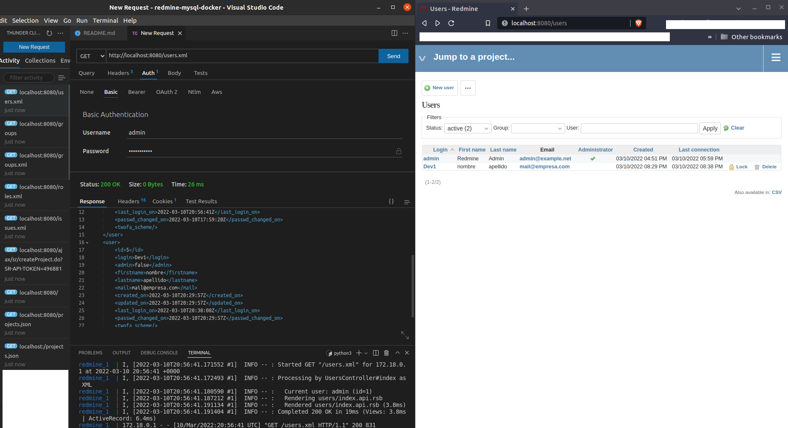

# REDMINE - MYSQL - DOCKER

### Create containers

## Case 1

### Running Redmine with a database server.

> 1.  Start a database container
>
>     - MySQL
>
>           $ docker run -d --name some-mysql --network some-network -e MYSQL_USER=redmine -e MYSQL_PASSWORD=secret -e MYSQL_DATABASE=redmine -e MYSQL_RANDOM_ROOT_PASSWORD=1 mysql:5.7
>
> 2.  Start redmine
>
>     $ docker run -d --name some-redmine --network some-network -e REDMINE_DB_MYSQL=some-mysql -e REDMINE_DB_USERNAME=redmine -e REDMINE_DB_PASSWORD=secret redmine

## Case 2

### Running Redmine and Mysql via docker-compose

### Create stack.yml with:

>            version: '3.1'
>
>            services:
>
>              redmine:
>                image: redmine
>                restart: always
>                ports:
>                  - 8080:3000
>                environment:
>                  REDMINE_DB_MYSQL: db
>                  REDMINE_DB_PASSWORD: example
>                  REDMINE_SECRET_KEY_BASE: supersecretkey
>
>              db:
>                image: mysql:5.7
>                restart: always
>                environment:
>                  MYSQL_ROOT_PASSWORD: example
>                  MYSQL_DATABASE: redmine
>
> ### And run
>
>        docker-compose -f stack.yml up

### Wait for it to initialize completely, and visit http://localhost:8080.

### REST Client

Example

- If the endpoint requires admin privileges go to

  > Auth > Basic > Complete with user and pass

      GET http://localhost:8080/users.xml

Response:

- Xml with your db data

      <?xml version="1.0" encoding="UTF-8"?>
      <users total_count="2" offset="0" limit="25" type="array">
        <user>
          <id>1</id>
          <login>admin</login>
          <admin>true</admin>
          <firstname>Redmine</firstname>
          <lastname>Admin</lastname>
          <mail>admin@example.net</mail>
          <created_on>2022-03-10T16:51:38Z</created_on>
          <updated_on>2022-03-10T17:59:20Z</updated_on>
          <last_login_on>2022-03-10T20:56:41Z</last_login_on>
          <passwd_changed_on>2022-03-10T17:59:20Z</passwd_changed_on>
          <twofa_scheme/>
        </user>
        <user>
          <id>5</id>
          <login>Dev1</login>
          <admin>false</admin>
          <firstname>nombre</firstname>
          <lastname>apellido</lastname>
          <mail>mail@empresa.com</mail>
          <created_on>2022-03-10T20:29:57Z</created_on>
          <updated_on>2022-03-10T20:29:57Z</updated_on>
          <last_login_on>2022-03-10T20:38:08Z</last_login_on>
          <passwd_changed_on>2022-03-10T20:29:57Z</passwd_changed_on>
          <twofa_scheme/>
        </user>
      </users>

### Example

